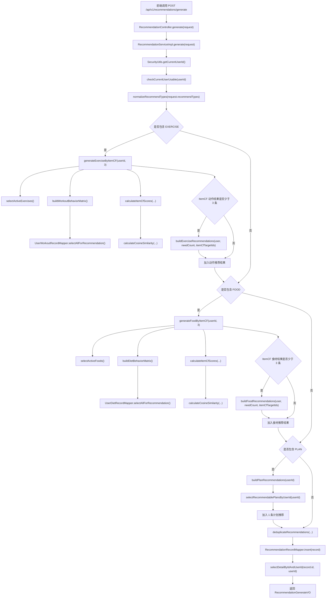

# 个性化推荐模块调用流程

本文档说明当前推荐功能从接口调用到推荐记录落库的主要方法流程。当前实现保持原接口不变，在推荐生成逻辑中优先使用 ItemCF 协同过滤，结果不足时使用原有规则推荐补齐。

## 一、相关接口

| 接口 | 说明 | 主要调用方法 |
| --- | --- | --- |
| `POST /api/v1/recommendations/generate` | 生成推荐 | `RecommendationService.generate(...)` |
| `GET /api/v1/recommendations/latest` | 查询最近一次推荐 | `RecommendationService.latest(...)` |
| `GET /api/v1/recommendations/history` | 查询推荐历史 | `RecommendationService.history(...)` |
| `GET /api/v1/admin/recommendations` | 管理端查询推荐记录 | `AdminRecommendationService` |

## 二、生成推荐总体流程

推荐入口在 `RecommendationController.generate(...)`，Controller 只负责接收请求并调用 Service，实际推荐逻辑位于 `RecommendationServiceImpl.generate(...)`。

当前每次生成数量为：

| 推荐类型 | 数量 | 优先算法 | 兜底算法 |
| --- | ---: | --- | --- |
| 动作推荐 `EXERCISE` | 3 条 | `ITEM_CF` | `RULE_BASED` |
| 食材推荐 `FOOD` | 3 条 | `ITEM_CF` | `RULE_BASED` |
| 计划推荐 `PLAN` | 1 条 | `RULE_BASED` | 无 |

整体步骤：

1. 从 Spring Security 登录态获取当前 `userId`。
2. 调用 `checkCurrentUserUsable(...)` 校验用户存在且状态可用。
3. 调用 `normalizeRecommendTypes(...)` 标准化请求中的推荐类型。
4. 如果包含 `EXERCISE`，先调用 `generateExerciseByItemCF(...)` 生成动作协同过滤推荐。
5. 如果动作 ItemCF 数量不足 3 条，调用 `buildExerciseRecommendations(...)` 使用规则推荐补齐。
6. 如果包含 `FOOD`，先调用 `generateFoodByItemCF(...)` 生成食材协同过滤推荐。
7. 如果食材 ItemCF 数量不足 3 条，调用 `buildFoodRecommendations(...)` 使用规则推荐补齐。
8. 如果包含 `PLAN`，调用 `buildPlanRecommendations(...)` 生成 1 条计划推荐。
9. 调用 `deduplicateRecommendations(...)` 按 `recType + targetId` 去重。
10. 逐条调用 `RecommendationRecordMapper.insert(...)` 写入 `recommendation_record` 表。
11. 插入后调用 `selectDetailByIdAndUserId(...)` 查询刚生成的详情，并组装原有响应格式。

## 三、调用流程图



## 四、动作 ItemCF 方法流程

入口方法：`generateExerciseByItemCF(Long userId, int limit)`

方法流程：

1. 调用 `recommendationRecordMapper.selectActiveExercises()` 查询 `fit_exercise.status = 1` 的动作。
2. 调用 `buildWorkoutBehaviorMatrix()` 构造用户-动作行为矩阵。
3. `buildWorkoutBehaviorMatrix()` 内部调用 `userWorkoutRecordMapper.selectAllForRecommendation()` 查询全站训练记录。
4. 对每条训练记录调用 `calculateWorkoutWeight(...)` 计算行为权重。
5. 获取当前用户已经训练过的动作集合，作为历史行为和排除集合。
6. 调用 `calculateItemCfScores(...)` 对候选动作打分。
7. `calculateItemCfScores(...)` 内部通过 `calculateCosineSimilarity(...)` 计算历史动作和候选动作之间的余弦相似度。
8. 排除当前用户已经训练过的动作，只保留可用动作。
9. 按得分倒序排序，最多返回 3 条。
10. 生成 `algorithmType = ITEM_CF` 的 `RecommendationRecord`。

动作权重规则：

| 条件 | 权重变化 |
| --- | ---: |
| 默认行为 | `+1.0` |
| `completionStatus = DONE` 或 `已完成` | `+1.0` |
| `feedbackScore` 不为空 | `+ feedbackScore / 5.0` |
| `durationMin` 不为空 | `+ min(durationMin / 60.0, 1.0)` |

## 五、食材 ItemCF 方法流程

入口方法：`generateFoodByItemCF(Long userId, int limit)`

方法流程：

1. 调用 `recommendationRecordMapper.selectActiveFoods()` 查询 `fit_food.status = 1` 的食材。
2. 调用 `buildDietBehaviorMatrix()` 构造用户-食材行为矩阵。
3. `buildDietBehaviorMatrix()` 内部调用 `userDietRecordMapper.selectAllForRecommendation()` 查询全站饮食记录。
4. 对每条饮食记录调用 `calculateDietWeight(...)` 计算行为权重。
5. 获取当前用户已经记录过的食材集合，作为历史行为和排除集合。
6. 调用 `calculateItemCfScores(...)` 对候选食材打分。
7. `calculateItemCfScores(...)` 内部通过 `calculateCosineSimilarity(...)` 计算历史食材和候选食材之间的余弦相似度。
8. 排除当前用户已经记录过的食材，只保留可用食材。
9. 按得分倒序排序，最多返回 3 条。
10. 生成 `algorithmType = ITEM_CF` 的 `RecommendationRecord`。

食材权重规则：

| 条件 | 权重变化 |
| --- | ---: |
| 默认行为 | `+1.0` |
| `intakeGrams` 不为空 | `+ min(intakeGrams / 500.0, 1.0)` |
| `isRecommended = 0` | `+0.5` |
| 同一用户多次记录同一食材 | 权重累加 |

## 六、规则推荐兜底流程

ItemCF 结果不足时会自动触发规则推荐补齐。

动作兜底入口：`buildExerciseRecommendations(SysUser user, int limit, Set<Long> extraExcludeIds)`

食材兜底入口：`buildFoodRecommendations(SysUser user, int limit, Set<Long> extraExcludeIds)`

触发条件：

1. 当前用户没有对应历史记录。
2. 全站行为矩阵用户数不足。
3. 可用动作或食材为空。
4. ItemCF 相似度打分结果为空。
5. ItemCF 结果数量少于目标数量。

兜底时仍会排除：

1. 当前用户已经训练过的动作。
2. 当前用户已经记录过的食材。
3. 最近已经推荐过的目标。
4. 本次 ItemCF 已经生成的目标。

规则推荐生成的记录仍使用：

```text
algorithmType = RULE_BASED
```

## 七、保存与查询流程

所有推荐结果最终都会写入现有 `recommendation_record` 表。

保存前处理：

1. `deduplicateRecommendations(...)` 按 `recType + targetId` 去重。
2. `generate(...)` 为每条记录设置当前 `userId`。
3. 调用 `recommendationRecordMapper.insert(record)` 插入数据库。
4. 插入成功后调用 `selectDetailByIdAndUserId(...)` 查询 VO。
5. 返回原有 `RecommendationGenerateVO`，不改变前端调用方式。

查询接口不区分推荐算法，仍从 `recommendation_record` 读取：

| 查询场景 | 方法 |
| --- | --- |
| 最新推荐 | `latest(String recType)` |
| 历史推荐 | `history(RecommendationHistoryQuery query)` |
| 用户推荐详情 | `detail(Long id)` |
| 管理端分页 | `AdminRecommendationService` 相关查询 |

## 八、核心 Mapper 调用

| Mapper 方法 | 用途 |
| --- | --- |
| `RecommendationRecordMapper.selectActiveExercises()` | 查询可推荐动作 |
| `RecommendationRecordMapper.selectActiveFoods()` | 查询可推荐食材 |
| `UserWorkoutRecordMapper.selectAllForRecommendation()` | 查询全站训练行为，构建动作 ItemCF 矩阵 |
| `UserDietRecordMapper.selectAllForRecommendation()` | 查询全站饮食行为，构建食材 ItemCF 矩阵 |
| `RecommendationRecordMapper.insert(...)` | 写入推荐记录 |
| `RecommendationRecordMapper.selectDetailByIdAndUserId(...)` | 查询生成后的推荐详情 |

## 九、结果验证 SQL

生成推荐后，可以通过下面 SQL 查看本次结果是否写入成功：

```sql
SELECT
    id,
    user_id,
    rec_type,
    target_id,
    target_name,
    algorithm_type,
    score,
    reason,
    created_at
FROM recommendation_record
WHERE user_id = 你的用户ID
ORDER BY created_at DESC, id DESC;
```

如果协同过滤生成成功，可以看到：

```text
algorithm_type = ITEM_CF
```

如果数据不足触发兜底，可以看到：

```text
algorithm_type = RULE_BASED
```
