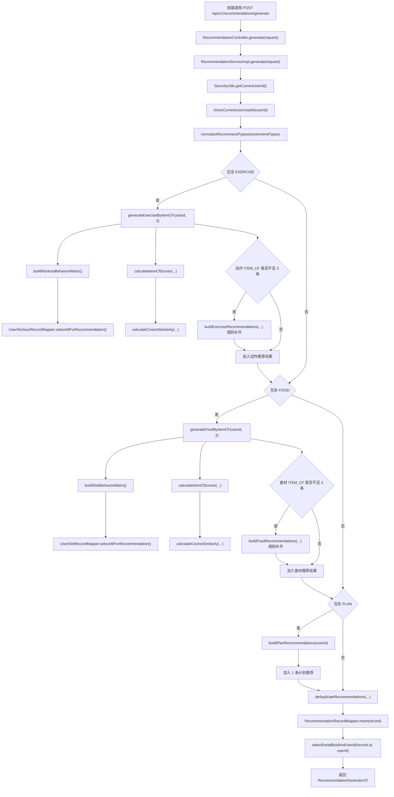

# 智能健身推荐系统接口设计说明（修订版）

## 1. 文档说明

### 1.1 文档目的
本文档用于说明“基于 Java 与 Spring Boot 的智能健身推荐系统”的后端接口设计与数据库修订方案，明确各功能模块的接口地址、请求方式、参数说明、返回结果、权限控制规则，以及逻辑外键与逻辑删除的实现约束，为系统开发、联调、测试与论文撰写提供统一依据。

### 1.2 适用范围
本文档适用于：
- 后端接口开发
- 前端页面对接
- 数据库设计与建表
- 系统测试与联调
- 毕业设计论文的系统设计章节

### 1.3 技术说明
- 后端框架：Spring Boot
- 安全框架：Spring Security
- 认证方式：JWT
- 数据交互格式：JSON
- 接口风格：RESTful
- 数据库：MySQL 8.x
- 字符编码：UTF-8

---

## 2. 本次修订说明

本次修订基于原始接口设计与数据库结构，进行了以下调整：

1. **新增计划明细表 `fitness_plan_item`**，用于支撑计划明细查询、新增、修改、打卡、删除等接口。
2. **删除预约接口中“修改地点”相关设计**，因为当前预约业务不再维护地点字段。
3. **删除数据库物理外键约束**，统一改为**逻辑外键**实现。
4. 在相关接口中补充**逻辑外键校验方案**与**逻辑删除方案**说明。
5. 对动作表、食材表的删除接口统一采用**逻辑删除**实现，避免业务数据丢失。
6. **推荐模块生成逻辑升级为 ItemCF + 规则兜底模式**，接口路径与返回格式保持不变，推荐结果继续写入 `recommendation_record` 表。

---

## 3. 接口设计规范

### 3.1 接口统一前缀
所有接口统一使用如下前缀：

```text
/api/v1
```

### 3.2 请求方式说明
| 请求方式 | 说明 |
|---|---|
| GET | 查询数据 |
| POST | 新增数据 / 执行业务操作 |
| PUT | 修改数据 |
| DELETE | 删除数据 |

### 3.3 统一返回格式
系统接口统一返回如下 JSON 结构：

```json
{
  "code": 200,
  "message": "success",
  "data": {}
}
```

### 3.4 返回字段说明
| 字段名 | 类型 | 说明 |
|---|---|---|
| code | int | 状态码，200 表示成功，其他表示失败 |
| message | string | 返回消息 |
| data | object | 返回业务数据 |

### 3.5 常用状态码说明
| 状态码 | 含义 |
|---|---|
| 200 | 请求成功 |
| 400 | 请求参数错误 |
| 401 | 未登录或 Token 无效 |
| 403 | 无访问权限 |
| 404 | 资源不存在 |
| 409 | 业务冲突 |
| 500 | 服务器内部错误 |

### 3.6 认证与权限控制
系统采用 JWT 进行身份认证。用户登录成功后，后端返回 Token，前端在后续请求头中携带：

```text
Authorization: Bearer xxxxxx
```

系统角色分为：
- 普通用户（ROLE_USER）
- 管理员（ROLE_ADMIN）

权限控制规则如下：
- 公共接口：未登录或登录后均可访问
- 用户接口：仅普通用户访问
- 管理员接口：仅管理员访问
- 公共查询接口：普通用户和管理员均可访问

---

## 4. 逻辑外键与逻辑删除设计说明

### 4.1 逻辑外键设计原则
本系统移除数据库中的 `FOREIGN KEY` 物理约束，改为由业务层进行逻辑关联校验。

适用字段示例：
- `appointment_info.user_id -> sys_user.id`
- `fitness_plan.user_id -> sys_user.id`
- `fitness_plan_item.plan_id -> fitness_plan.id`
- `user_workout_record.user_id -> sys_user.id`
- `user_workout_record.exercise_id -> fit_exercise.id`
- `user_diet_record.user_id -> sys_user.id`
- `user_diet_record.food_id -> fit_food.id`
- `recommendation_record.user_id -> sys_user.id`

### 4.2 逻辑外键编写规范
后端功能编写时，凡是涉及逻辑关联字段，统一按以下流程处理：

1. **新增前校验**：先查询主表数据是否存在。
2. **状态校验**：若主表存在状态字段，还需校验是否为可用状态。
3. **权限校验**：若数据归属于某用户，必须校验当前登录人是否有权访问。
4. **删除前校验**：若主数据已被业务引用，应根据业务规则执行逻辑删除、禁止删除或提示冲突。
5. **查询展示**：列表或详情接口可采用联表查询、子查询、或冗余字段回填关联名称。

### 4.3 推荐实现方式
在 Service 层建议统一封装以下方法：
- `checkUserExists(userId)`
- `checkExerciseUsable(exerciseId)`
- `checkFoodUsable(foodId)`
- `checkPlanExists(planId)`
- `checkPlanItemOwnership(itemId, currentUserId)`

### 4.4 逻辑删除设计原则
逻辑删除适用于基础资料类数据：
- 动作表 `fit_exercise`
- 食材表 `fit_food`

逻辑删除规则：
- 删除接口仍保留 `DELETE` 语义；
- 实际执行 SQL 为 `UPDATE ... SET status = 0`；
- 用户端查询默认只查 `status = 1`；
- 管理员端可按需查询全部数据。

---

## 5. 通用返回对象定义

### 5.1 LoginVO
| 字段 | 类型 | 说明 |
|---|---|---|
| token | string | JWT 令牌 |
| userId | long | 用户ID |
| username | string | 用户名 |
| roleCode | string | 角色编码 |
| roleName | string | 角色名称 |

### 5.2 UserProfileVO
| 字段 | 类型 | 说明 |
|---|---|---|
| id | long | 用户ID |
| username | string | 用户名 |
| realName | string | 真实姓名 |
| nickname | string | 昵称 |
| gender | string | 性别 |
| age | int | 年龄 |
| phone | string | 手机号 |
| email | string | 邮箱 |
| heightCm | decimal(5,2) | 身高 |
| weightKg | decimal(5,2) | 体重 |
| bmi | decimal(5,2) | BMI |
| fitnessGoal | string | 健身目标 |
| activityLevel | string | 运动水平 |
| dietPreference | string | 饮食偏好 |
| roleId | long | 角色ID |
| roleCode | string | 角色编码 |
| roleName | string | 角色名称 |
| status | int | 状态 |
| createdAt | datetime | 创建时间 |
| updatedAt | datetime | 更新时间 |

### 5.3 ExerciseVO
| 字段 | 类型 | 说明 |
|---|---|---|
| id | long | 动作ID |
| exerciseName | string | 动作名称 |
| category | string | 动作分类 |
| bodyPart | string | 训练部位 |
| difficulty | string | 难度等级 |
| equipment | string | 器械要求 |
| caloriesPerHour | int | 每小时消耗热量 |
| defaultSets | int | 默认组数 |
| defaultReps | int | 默认次数 |
| durationMin | int | 建议时长 |
| description | string | 动作说明 |
| caution | string | 注意事项 |
| status | int | 状态 |
| createdAt | datetime | 创建时间 |
| updatedAt | datetime | 更新时间 |

### 5.4 FoodVO
| 字段 | 类型 | 说明 |
|---|---|---|
| id | long | 食材ID |
| foodName | string | 食材名称 |
| category | string | 食材分类 |
| caloriesPer100g | decimal(6,2) | 每100g热量 |
| proteinPer100g | decimal(6,2) | 每100g蛋白质 |
| fatPer100g | decimal(6,2) | 每100g脂肪 |
| carbPer100g | decimal(6,2) | 每100g碳水 |
| suitableGoal | string | 适用目标 |
| suitableTime | string | 适用时间 |
| description | string | 食材说明 |
| status | int | 状态 |
| createdAt | datetime | 创建时间 |
| updatedAt | datetime | 更新时间 |

### 5.5 WorkoutRecordVO
| 字段 | 类型 | 说明 |
|---|---|---|
| id | long | 训练记录ID |
| userId | long | 用户ID |
| exerciseId | long | 动作ID |
| exerciseName | string | 动作名称 |
| workoutDate | date | 训练日期 |
| durationMin | int | 训练时长 |
| setsCount | int | 完成组数 |
| repsCount | int | 完成次数 |
| caloriesBurned | int | 消耗热量 |
| completionStatus | string | 完成状态 |
| feedbackScore | int | 用户评分 |
| remark | string | 备注 |
| createdAt | datetime | 创建时间 |

### 5.6 DietRecordVO
| 字段 | 类型 | 说明 |
|---|---|---|
| id | long | 饮食记录ID |
| userId | long | 用户ID |
| foodId | long | 食材ID |
| foodName | string | 食材名称 |
| dietDate | date | 饮食日期 |
| mealType | string | 餐次 |
| intakeGrams | decimal(6,2) | 摄入克数 |
| caloriesIntake | int | 摄入热量 |
| isRecommended | int | 是否系统推荐 |
| remark | string | 备注 |
| createdAt | datetime | 创建时间 |

### 5.7 RecommendationVO
| 字段 | 类型 | 说明 |
|---|---|---|
| id | long | 推荐记录ID |
| userId | long | 用户ID |
| recType | string | 推荐类型 |
| targetId | long | 推荐对象ID |
| targetName | string | 推荐对象名称 |
| algorithmType | string | 算法类型：`ITEM_CF` 表示基于物品的协同过滤推荐，`RULE_BASED` 表示规则推荐 |
| score | decimal(5,2) | 推荐得分 |
| reason | string | 推荐原因 |
| createdAt | datetime | 创建时间 |

### 5.8 PlanVO
| 字段 | 类型 | 说明 |
|---|---|---|
| id | long | 计划ID |
| userId | long | 用户ID |
| planType | string | 计划类型：TRAINING、DIET |
| planName | string | 计划名称 |
| cycleType | string | 周期类型：DAILY、WEEKLY |
| startDate | date | 开始日期 |
| endDate | date | 结束日期 |
| targetGoal | string | 目标 |
| sourceType | string | 来源 |
| status | string | 状态 |
| notes | string | 备注 |
| createdAt | datetime | 创建时间 |
| updatedAt | datetime | 更新时间 |

### 5.9 PlanItemVO
| 字段 | 类型 | 说明 |
|---|---|---|
| id | long | 明细ID |
| planId | long | 计划ID |
| itemType | string | 明细类型：EXERCISE、FOOD |
| targetId | long | 关联对象ID |
| targetName | string | 对象名称 |
| itemDate | date | 执行日期 |
| itemTime | time | 执行时间 |
| setsCount | int | 组数 |
| repsCount | int | 次数 |
| durationMin | int | 时长 |
| intakeGrams | decimal(6,2) | 摄入克数 |
| calories | int | 热量 |
| completionStatus | string | 完成状态 |
| sortNo | int | 排序号 |
| remark | string | 备注 |
| createdAt | datetime | 创建时间 |
| updatedAt | datetime | 更新时间 |

### 5.10 AppointmentVO
| 字段 | 类型 | 说明 |
|---|---|---|
| id | long | 预约ID |
| userId | long | 用户ID |
| name | string | 预约人姓名 |
| phone | string | 联系电话 |
| gender | string | 性别 |
| age | int | 年龄 |
| appointmentType | string | 预约类型 |
| reserveDate | date | 预约日期 |
| reserveTime | time | 预约时间 |
| status | string | 状态 |
| remark | string | 备注 |
| createdAt | datetime | 创建时间 |
| updatedAt | datetime | 更新时间 |

---

## 6. 认证模块接口设计 1

### 6.1 用户注册
- **请求URL**：`POST /api/v1/auth/register`
- **请求方式**：`POST`
- **访问权限**：公共接口

#### 请求参数（Body）
| 参数名 | 类型 | 是否必填 | 说明 |
|---|---|---|---|
| username | string | 是 | 用户名，唯一 |
| password | string | 是 | 明文密码，后端加密存储 |
| realName | string | 否 | 真实姓名 |
| nickname | string | 否 | 昵称 |
| phone | string | 否 | 手机号，唯一 |
| email | string | 否 | 邮箱，唯一 |

#### 返回参数
| 参数名 | 类型 | 说明 |
|---|---|---|
| userId | long | 新注册用户ID |
| username | string | 用户名 |

### 6.2 用户登录
- **请求URL**：`POST /api/v1/auth/login`
- **请求方式**：`POST`
- **访问权限**：公共接口

#### 请求参数（Body）
| 参数名 | 类型 | 是否必填 | 说明 |
|---|---|---|---|
| username | string | 是 | 用户名 |
| password | string | 是 | 密码 |

#### 返回参数
`data` 返回 `LoginVO`

### 6.3 用户退出登录
- **请求URL**：`POST /api/v1/auth/logout`
- **请求方式**：`POST`
- **访问权限**：用户 / 管理员

#### 请求参数
无

#### 返回参数
`data = null`

### 6.4 获取当前登录用户信息
- **请求URL**：`GET /api/v1/auth/me`
- **请求方式**：`GET`
- **访问权限**：用户 / 管理员

#### 请求参数
无

#### 返回参数
`data` 返回 `UserProfileVO`

---

## 7. 用户信息模块接口设计

### 7.1 查看当前用户信息 1
- **请求URL**：`GET /api/v1/users/me`
- **请求方式**：`GET`
- **访问权限**：用户 / 管理员

#### 请求参数
无

#### 返回参数
`data` 返回 `UserProfileVO`

### 7.2 修改当前用户信息 1
- **请求URL**：`PUT /api/v1/users/me`
- **请求方式**：`PUT`
- **访问权限**：用户 / 管理员

#### 请求参数（Body）
| 参数名 | 类型 | 是否必填 | 说明 |
|---|---|---|---|
| realName | string | 否 | 真实姓名 |
| nickname | string | 否 | 昵称 |
| gender | string | 否 | 性别 |
| age | int | 否 | 年龄 |
| phone | string | 否 | 手机号 |
| email | string | 否 | 邮箱 |
| heightCm | decimal(5,2) | 否 | 身高(cm) |
| weightKg | decimal(5,2) | 否 | 体重(kg) |
| bmi | decimal(5,2) | 否 | BMI |
| fitnessGoal | string | 否 | 健身目标 |
| activityLevel | string | 否 | 运动水平 |
| dietPreference | string | 否 | 饮食偏好 |

#### 返回参数
`data` 返回 `UserProfileVO`

### 7.3 修改密码 1
- **请求URL**：`PUT /api/v1/users/me/password`
- **请求方式**：`PUT`
- **访问权限**：用户 / 管理员

#### 请求参数（Body）
| 参数名 | 类型 | 是否必填 | 说明 |
|---|---|---|---|
| oldPassword | string | 是 | 原密码 |
| newPassword | string | 是 | 新密码 |

#### 返回参数
`data = null`

---

## 8. 动作库模块接口设计 

### 8.1 分页查询动作列表 1
- **请求URL**：`GET /api/v1/exercises`
- **请求方式**：`GET`
- **访问权限**：用户 / 管理员

#### 请求参数（Query）
| 参数名 | 类型 | 是否必填 | 说明 |
|---|---|---|---|
| pageNum | int | 否 | 页码，默认1 |
| pageSize | int | 否 | 每页条数，默认10 |
| category | string | 否 | 动作分类 |
| bodyPart | string | 否 | 训练部位 |
| difficulty | string | 否 | 难度等级 |

#### 返回参数
| 参数名 | 类型 | 说明 |
|---|---|---|
| list | ExerciseVO[] | 动作列表 |
| total | long | 总数 |
| pageNum | int | 当前页 |
| pageSize | int | 每页条数 |
| pages | int | 总页数 |

#### 功能编写说明
用户端查询必须默认加条件：`status = 1`，屏蔽已逻辑删除动作。

### 8.2 查看动作详情 1
- **请求URL**：`GET /api/v1/exercises/{id}`
- **请求方式**：`GET`
- **访问权限**：用户 / 管理员

#### 请求参数
| 参数名 | 类型 | 是否必填 | 说明 |
|---|---|---|---|
| id | long | 是 | 动作ID |

#### 返回参数
`data` 返回 `ExerciseVO`

#### 功能编写说明
若用户端访问，需校验该动作 `status = 1`；管理员端可查看全部状态数据。

### 8.3 新增动作 1
- **请求URL**：`POST /api/v1/admin/exercises`
- **请求方式**：`POST`
- **访问权限**：管理员

#### 请求参数（Body）
| 参数名 | 类型 | 是否必填 | 说明 |
|---|---|---|---|
| exerciseName | string | 是 | 动作名称 |
| category | string | 是 | 动作分类 |
| bodyPart | string | 否 | 训练部位 |
| difficulty | string | 否 | 难度等级 |
| equipment | string | 否 | 器械要求 |
| caloriesPerHour | int | 否 | 每小时消耗热量 |
| defaultSets | int | 否 | 默认组数 |
| defaultReps | int | 否 | 默认次数 |
| durationMin | int | 否 | 建议时长 |
| description | string | 否 | 动作说明 |
| caution | string | 否 | 注意事项 |
| status | int | 否 | 状态，默认1 |

#### 返回参数
`data` 返回 `ExerciseVO`

### 8.4 修改动作 1
- **请求URL**：`PUT /api/v1/admin/exercises/{id}`
- **请求方式**：`PUT`
- **访问权限**：管理员

#### 请求参数
Path：`id` 为动作ID；Body 同新增动作，均可选。

#### 返回参数
`data` 返回 `ExerciseVO`

### 8.5 删除动作 1
- **请求URL**：`DELETE /api/v1/admin/exercises/{id}`
- **请求方式**：`DELETE`
- **访问权限**：管理员

#### 请求参数
Path：`id` 为动作ID。

#### 返回参数
`data = null`

#### 功能编写说明
本接口采用**逻辑删除**，后端实际执行：

```sql
UPDATE fit_exercise SET status = 0, updated_at = NOW() WHERE id = ?;
```

删除前建议执行以下校验：
1. 查询动作是否存在；
2. 若不存在则返回 404；
3. 若已是停用状态，可直接返回成功或提示“已删除”；
4. 历史训练记录无需联动删除，保留业务痕迹。

### 8.6 后台查询动作列表 1
- **请求URL**：`GET /api/v1/admin/exercises`
- **请求方式**：`GET`
- **访问权限**：管理员

#### 请求参数（Query）
| 参数名 | 类型 | 是否必填 | 说明 |
|---|---|---|---|
| pageNum | int | 否 | 页码 |
| pageSize | int | 否 | 每页条数 |
| exerciseName | string | 否 | 动作名称模糊查询 |
| category | string | 否 | 动作分类 |
| bodyPart | string | 否 | 训练部位 |
| difficulty | string | 否 | 难度等级 |
| status | int | 否 | 状态 |

#### 返回参数
分页返回 `ExerciseVO` 列表。

---

## 9. 食材库模块接口设计

### 9.1 分页查询食材列表 1
- **请求URL**：`GET /api/v1/foods`
- **请求方式**：`GET`
- **访问权限**：用户 / 管理员

#### 请求参数（Query）
| 参数名 | 类型 | 是否必填 | 说明 |
|---|---|---|---|
| pageNum | int | 否 | 页码 |
| pageSize | int | 否 | 每页条数 |
| category | string | 否 | 食材分类 |
| suitableGoal | string | 否 | 适用目标 |
| suitableTime | string | 否 | 适用时间 |

#### 返回参数
分页返回 `FoodVO` 列表。

#### 功能编写说明
用户端查询默认限制 `status = 1`。

### 9.2 查看食材详情 1
- **请求URL**：`GET /api/v1/foods/{id}`
- **请求方式**：`GET`
- **访问权限**：用户 / 管理员

#### 请求参数
Path：`id` 为食材ID。

#### 返回参数
`data` 返回 `FoodVO`

### 9.3 新增食材 1
- **请求URL**：`POST /api/v1/admin/foods`
- **请求方式**：`POST`
- **访问权限**：管理员

#### 请求参数（Body）
| 参数名 | 类型 | 是否必填 | 说明 |
|---|---|---|---|
| foodName | string | 是 | 食材名称 |
| category | string | 否 | 食材分类 |
| caloriesPer100g | decimal(6,2) | 否 | 每100g热量 |
| proteinPer100g | decimal(6,2) | 否 | 每100g蛋白质 |
| fatPer100g | decimal(6,2) | 否 | 每100g脂肪 |
| carbPer100g | decimal(6,2) | 否 | 每100g碳水 |
| suitableGoal | string | 否 | 适用目标 |
| suitableTime | string | 否 | 适用时间 |
| description | string | 否 | 食材说明 |
| status | int | 否 | 状态，默认1 |

#### 返回参数
`data` 返回 `FoodVO`

### 9.4 修改食材 1
- **请求URL**：`PUT /api/v1/admin/foods/{id}`
- **请求方式**：`PUT`
- **访问权限**：管理员

#### 请求参数
Path：`id` 为食材ID；Body 同新增食材。

#### 返回参数
`data` 返回 `FoodVO`

### 9.5 删除食材 1
- **请求URL**：`DELETE /api/v1/admin/foods/{id}`
- **请求方式**：`DELETE`
- **访问权限**：管理员

#### 请求参数
Path：`id` 为食材ID。

#### 返回参数
`data = null`

#### 功能编写说明
本接口采用**逻辑删除**，后端实际执行：

```sql
UPDATE fit_food SET status = 0, updated_at = NOW() WHERE id = ?;
```

删除后历史饮食记录仍保留，详情展示时可以通过冗余名称字段或历史快照保证可读性。

### 9.6 后台查询食材列表 1
- **请求URL**：`GET /api/v1/admin/foods`
- **请求方式**：`GET`
- **访问权限**：管理员

#### 请求参数（Query）
| 参数名 | 类型 | 是否必填 | 说明 |
|---|---|---|---|
| pageNum | int | 否 | 页码 |
| pageSize | int | 否 | 每页条数 |
| foodName | string | 否 | 食材名称模糊查询 |
| category | string | 否 | 食材分类 |
| suitableGoal | string | 否 | 适用目标 |
| suitableTime | string | 否 | 适用时间 |
| status | int | 否 | 状态 |

#### 返回参数
分页返回 `FoodVO` 列表。

---

## 10. 用户训练记录模块接口设计

### 10.1 新增训练记录 1
- **请求URL**：`POST /api/v1/workout-records`
- **请求方式**：`POST`
- **访问权限**：用户

#### 请求参数（Body）
| 参数名 | 类型 | 是否必填 | 说明 |
|---|---|---|---|
| exerciseId | long | 是 | 动作ID |
| workoutDate | date | 是 | 训练日期 |
| durationMin | int | 否 | 训练时长 |
| setsCount | int | 否 | 完成组数 |
| repsCount | int | 否 | 完成次数 |
| caloriesBurned | int | 否 | 消耗热量 |
| completionStatus | string | 否 | 完成状态 |
| feedbackScore | int | 否 | 评分1-5 |
| remark | string | 否 | 备注 |

#### 返回参数
`data` 返回 `WorkoutRecordVO`

#### 功能编写说明
由于 `exerciseId` 为逻辑外键，新增前必须：
1. 根据 `exerciseId` 查询动作是否存在；
2. 校验动作 `status = 1`；
3. 将当前登录用户ID写入 `user_id`，前端不传 `userId`。

### 10.2 查询训练记录列表 1
- **请求URL**：`GET /api/v1/workout-records`
- **请求方式**：`GET`
- **访问权限**：用户

#### 请求参数（Query）
| 参数名 | 类型 | 是否必填 | 说明 |
|---|---|---|---|
| pageNum | int | 否 | 页码 |
| pageSize | int | 否 | 每页条数 |
| workoutDateStart | date | 否 | 开始日期 |
| workoutDateEnd | date | 否 | 结束日期 |
| exerciseId | long | 否 | 动作ID |
| completionStatus | string | 否 | 完成状态 |

#### 返回参数
分页返回 `WorkoutRecordVO` 列表。

### 10.3 查看训练记录详情 1
- **请求URL**：`GET /api/v1/workout-records/{id}`
- **请求方式**：`GET`
- **访问权限**：用户

#### 请求参数
Path：`id` 为训练记录ID。

#### 返回参数
`data` 返回 `WorkoutRecordVO`

#### 功能编写说明
必须校验该记录 `user_id` 是否等于当前登录用户ID，防止越权访问。

### 10.4 修改训练记录 1
- **请求URL**：`PUT /api/v1/workout-records/{id}`
- **请求方式**：`PUT`
- **访问权限**：用户

#### 请求参数
Path：`id` 为训练记录ID；Body 同新增训练记录，均可选。

#### 返回参数
`data` 返回 `WorkoutRecordVO`

#### 功能编写说明
若更新 `exerciseId`，需重新执行逻辑外键校验。

### 10.5 删除训练记录 1
- **请求URL**：`DELETE /api/v1/workout-records/{id}`
- **请求方式**：`DELETE`
- **访问权限**：用户

#### 请求参数
Path：`id` 为训练记录ID。

#### 返回参数
`data = null`

---

## 11. 用户饮食记录模块接口设计

### 11.1 新增饮食记录 1
- **请求URL**：`POST /api/v1/diet-records`
- **请求方式**：`POST`
- **访问权限**：用户

#### 请求参数（Body）
| 参数名 | 类型 | 是否必填 | 说明 |
|---|---|---|---|
| foodId | long | 是 | 食材ID |
| dietDate | date | 是 | 饮食日期 |
| mealType | string | 否 | 早餐/午餐/晚餐/加餐 |
| intakeGrams | decimal(6,2) | 否 | 摄入克数 |
| caloriesIntake | int | 否 | 摄入热量 |
| isRecommended | int | 否 | 是否来自推荐，默认0 |
| remark | string | 否 | 备注 |

#### 返回参数
`data` 返回 `DietRecordVO`

#### 功能编写说明
由于 `foodId` 为逻辑外键，新增前必须：
1. 查询食材是否存在；
2. 校验食材 `status = 1`；
3. 当前用户ID由后端从登录态获取。

### 11.2 查询饮食记录列表 1
- **请求URL**：`GET /api/v1/diet-records`
- **请求方式**：`GET`
- **访问权限**：用户

#### 请求参数（Query）
| 参数名 | 类型 | 是否必填 | 说明 |
|---|---|---|---|
| pageNum | int | 否 | 页码 |
| pageSize | int | 否 | 每页条数 |
| dietDateStart | date | 否 | 开始日期 |
| dietDateEnd | date | 否 | 结束日期 |
| mealType | string | 否 | 餐次 |
| foodId | long | 否 | 食材ID |

#### 返回参数
分页返回 `DietRecordVO` 列表。

### 11.3 查看饮食记录详情 1
- **请求URL**：`GET /api/v1/diet-records/{id}`
- **请求方式**：`GET`
- **访问权限**：用户

#### 请求参数
Path：`id` 为饮食记录ID。

#### 返回参数
`data` 返回 `DietRecordVO`

### 11.4 修改饮食记录 1
- **请求URL**：`PUT /api/v1/diet-records/{id}`
- **请求方式**：`PUT`
- **访问权限**：用户

#### 请求参数
Path：`id` 为饮食记录ID；Body 同新增饮食记录。

#### 返回参数
`data` 返回 `DietRecordVO`

#### 功能编写说明
若更新 `foodId`，需重新校验食材是否存在且可用。

### 11.5 删除饮食记录 1
- **请求URL**：`DELETE /api/v1/diet-records/{id}`
- **请求方式**：`DELETE`
- **访问权限**：用户

#### 请求参数
Path：`id` 为饮食记录ID。

#### 返回参数
`data = null`

---

## 12. 推荐模块接口设计

### 12.1 生成个性化推荐 1
- **请求URL**：`POST /api/v1/recommendations/generate`
- **请求方式**：`POST`
- **访问权限**：用户

#### 请求参数（Body）
| 参数名 | 类型 | 是否必填 | 说明 |
|---|---|---|---|
| recommendTypes | string[] | 是 | 推荐类型数组：`EXERCISE`、`FOOD`、`PLAN` |

#### 返回参数
| 参数名 | 类型 | 说明 |
|---|---|---|
| generatedCount | int | 本次实际生成并写入推荐记录表的条数 |
| list | RecommendationVO[] | 推荐结果列表 |

#### 当前生成数量规则
| 推荐类型 | 每次最多生成数量 | 推荐算法 |
|---|---:|---|
| `EXERCISE` 动作推荐 | 3 条 | 优先 `ITEM_CF`，不足时使用 `RULE_BASED` 补齐 |
| `FOOD` 食材推荐 | 3 条 | 优先 `ITEM_CF`，不足时使用 `RULE_BASED` 补齐 |
| `PLAN` 计划推荐 | 1 条 | 使用 `RULE_BASED` |

说明：如果请求中同时包含 `EXERCISE`、`FOOD`、`PLAN`，理论上最多生成 7 条推荐记录。若可推荐数据不足，实际返回条数可能少于 7 条，以 `generatedCount` 为准。

#### 功能编写说明
生成推荐时，后端仍从当前登录态获取 `userId`，前端不需要传用户ID，也不需要改变原有调用方式。推荐结果统一写入现有 `recommendation_record` 表，查询最新推荐、推荐历史和管理员推荐记录时仍读取该表。

推荐生成主流程如下：

1. Controller 调用 `RecommendationService.generate(...)`。
2. Service 通过 `SecurityUtils.getCurrentUserId()` 获取当前登录用户ID。
3. 调用 `checkCurrentUserUsable(...)` 校验用户存在且状态可用。
4. 调用 `normalizeRecommendTypes(...)` 标准化推荐类型。
5. 若包含 `EXERCISE`，先调用 `generateExerciseByItemCF(userId, 3)` 生成动作协同过滤推荐。
6. 若动作 `ITEM_CF` 结果不足 3 条，调用 `buildExerciseRecommendations(...)` 使用规则推荐补齐。
7. 若包含 `FOOD`，先调用 `generateFoodByItemCF(userId, 3)` 生成食材协同过滤推荐。
8. 若食材 `ITEM_CF` 结果不足 3 条，调用 `buildFoodRecommendations(...)` 使用规则推荐补齐。
9. 若包含 `PLAN`，调用 `buildPlanRecommendations(userId)` 生成 1 条计划推荐。
10. 调用 `deduplicateRecommendations(...)` 按 `recType + targetId` 去重。
11. 调用 `RecommendationRecordMapper.insert(...)` 将推荐记录写入 `recommendation_record` 表。
12. 插入后调用 `selectDetailByIdAndUserId(...)` 查询刚生成的 VO，并按原返回结构返回给前端。

#### 推荐生成调用流程图



#### ItemCF 动作推荐说明
动作推荐入口方法为 `generateExerciseByItemCF(Long userId, int limit)`。

处理逻辑：

1. 查询 `fit_exercise.status = 1` 的可用动作。
2. 查询全站 `user_workout_record` 训练行为。
3. 构造用户-动作行为矩阵：`userId -> exerciseId -> weight`。
4. 根据当前用户已训练过的动作，计算未训练动作的协同过滤得分。
5. 排除当前用户已经训练过的动作。
6. 只推荐 `status = 1` 的动作。
7. 按得分倒序取前 3 条。
8. 生成 `algorithmType = ITEM_CF` 的推荐记录。

动作行为权重计算规则：

| 条件 | 权重变化 |
|---|---:|
| 默认行为权重 | `+1.0` |
| `completionStatus = DONE` 或 `已完成` | `+1.0` |
| `feedbackScore` 不为空 | `+ feedbackScore / 5.0` |
| `durationMin` 不为空 | `+ min(durationMin / 60.0, 1.0)` |

动作 `ITEM_CF` 推荐原因固定为：

```text
根据您的历史训练记录和相似动作偏好生成
```

#### ItemCF 食材推荐说明
食材推荐入口方法为 `generateFoodByItemCF(Long userId, int limit)`。

处理逻辑：

1. 查询 `fit_food.status = 1` 的可用食材。
2. 查询全站 `user_diet_record` 饮食行为。
3. 构造用户-食材行为矩阵：`userId -> foodId -> weight`。
4. 根据当前用户已记录过的食材，计算未记录食材的协同过滤得分。
5. 排除当前用户已经记录过的食材。
6. 只推荐 `status = 1` 的食材。
7. 按得分倒序取前 3 条。
8. 生成 `algorithmType = ITEM_CF` 的推荐记录。

食材行为权重计算规则：

| 条件 | 权重变化 |
|---|---:|
| 默认行为权重 | `+1.0` |
| `intakeGrams` 不为空 | `+ min(intakeGrams / 500.0, 1.0)` |
| `isRecommended = 0`，表示用户主动记录 | `+0.5` |
| 同一用户多次记录同一食材 | 权重累加 |

食材 `ITEM_CF` 推荐原因固定为：

```text
根据您的历史饮食记录和相似食材偏好生成
```

#### ItemCF 相似度与打分说明
当前实现使用余弦相似度计算物品之间的相似度。

对于物品 `itemA` 和 `itemB`：

1. 遍历所有用户行为矩阵。
2. 分子为同时对两个物品有行为的用户权重乘积之和：`sum(weightA * weightB)`。
3. 分母为两个物品权重平方和开根号后的乘积：`sqrt(sum(weightA^2)) * sqrt(sum(weightB^2))`。
4. 相似度为：`similarity = numerator / denominator`。

当前用户对候选物品的得分为：

```text
score(candidate) = sum(similarity(historyItem, candidate) * userWeight(historyItem))
```

推荐得分保留两位小数后写入 `recommendation_record.score`。

#### 规则推荐兜底说明
当协同过滤推荐结果不足或无法生成时，自动使用原有 `RULE_BASED` 推荐逻辑补齐。触发场景包括：

1. 当前用户没有训练记录或饮食记录。
2. 全站训练记录或饮食记录不足，无法形成有效行为矩阵。
3. 可用动作或食材为空。
4. ItemCF 相似度打分结果为空。
5. ItemCF 生成数量少于目标数量。

兜底时仍会避免重复推荐：

1. 不推荐当前用户已经训练过的动作。
2. 不推荐当前用户已经记录过的食材。
3. 不重复推荐同一次生成中已经由 ItemCF 生成的目标。
4. 保存前按 `recType + targetId` 去重。

### 12.2 查询最新推荐结果 1
- **请求URL**：`GET /api/v1/recommendations/latest`
- **请求方式**：`GET`
- **访问权限**：用户

#### 请求参数（Query）
| 参数名 | 类型 | 是否必填 | 说明 |
|---|---|---|---|
| recType | string | 否 | 推荐类型筛选：`EXERCISE`、`FOOD`、`PLAN` |

#### 返回参数
| 参数名 | 类型 | 说明 |
|---|---|---|
| latestTime | datetime | 最近一次推荐时间 |
| list | RecommendationVO[] | 最新推荐列表 |

#### 功能编写说明
该接口继续从 `recommendation_record` 表查询最近一次生成的推荐结果，不区分 `ITEM_CF` 或 `RULE_BASED`。前端可通过 `RecommendationVO.algorithmType` 展示推荐算法来源。

### 12.3 查询推荐历史 1
- **请求URL**：`GET /api/v1/recommendations/history`
- **请求方式**：`GET`
- **访问权限**：用户

#### 请求参数（Query）
| 参数名 | 类型 | 是否必填 | 说明 |
|---|---|---|---|
| pageNum | int | 否 | 页码，默认1 |
| pageSize | int | 否 | 每页条数，默认10 |
| recType | string | 否 | 推荐类型：`EXERCISE`、`FOOD`、`PLAN` |

#### 返回参数
分页返回 `RecommendationVO` 列表。

#### 功能编写说明
历史接口继续查询 `recommendation_record` 表，新增 `ITEM_CF` 算法记录后无需修改前端调用方式。

### 12.4 查看推荐详情 1
- **请求URL**：`GET /api/v1/recommendations/{id}`
- **请求方式**：`GET`
- **访问权限**：用户

#### 请求参数
Path：`id` 为推荐记录ID。

#### 返回参数
`data` 返回 `RecommendationVO`

#### 功能编写说明
只能查看当前登录用户自己的推荐记录。

### 12.5 管理员查看全部推荐记录 1
- **请求URL**：`GET /api/v1/admin/recommendations`
- **请求方式**：`GET`
- **访问权限**：管理员

#### 请求参数（Query）
| 参数名 | 类型 | 是否必填 | 说明 |
|---|---|---|---|
| pageNum | int | 否 | 页码，默认1 |
| pageSize | int | 否 | 每页条数，默认10 |
| userId | long | 否 | 用户ID |
| recType | string | 否 | 推荐类型：`EXERCISE`、`FOOD`、`PLAN` |

#### 返回参数
分页返回 `RecommendationVO` 列表。

#### 功能编写说明
管理员推荐记录页面继续读取 `recommendation_record` 表。新增 `ITEM_CF` 算法后，管理员列表中的 `algorithmType` 字段可能出现 `ITEM_CF` 或 `RULE_BASED`。

---

## 13. 健身计划管理模块接口设计

### 13.1 生成计划 1
- **请求URL**：`POST /api/v1/plans/generate`
- **请求方式**：`POST`
- **访问权限**：用户

#### 请求参数（Body）
| 参数名 | 类型 | 是否必填 | 说明 |
|---|---|---|---|
| planType | string | 是 | TRAINING / DIET |
| planName | string | 是 | 计划名称 |
| cycleType | string | 是 | DAILY / WEEKLY |
| startDate | date | 是 | 开始日期 |
| endDate | date | 是 | 结束日期 |
| targetGoal | string | 否 | 目标 |
| sourceType | string | 否 | 来源，默认 SYSTEM |
| notes | string | 否 | 备注 |

#### 返回参数
`data` 返回 `PlanVO`

#### 功能编写说明
`fitness_plan.user_id` 为逻辑外键，由后端从登录态写入，不允许前端直接传用户ID。

### 13.2 查询计划列表 1
- **请求URL**：`GET /api/v1/plans`
- **请求方式**：`GET`
- **访问权限**：用户

#### 请求参数（Query）
| 参数名 | 类型 | 是否必填 | 说明 |
|---|---|---|---|
| pageNum | int | 否 | 页码 |
| pageSize | int | 否 | 每页条数 |
| planType | string | 否 | 计划类型 |
| status | string | 否 | 状态 |
| startDate | date | 否 | 开始日期 |
| endDate | date | 否 | 结束日期 |

#### 返回参数
分页返回 `PlanVO` 列表。

### 13.3 查看计划详情 1
- **请求URL**：`GET /api/v1/plans/{id}`
- **请求方式**：`GET`
- **访问权限**：用户

#### 请求参数
Path：`id` 为计划ID。

#### 返回参数
`data` 返回 `PlanVO`

#### 功能编写说明
必须校验该计划是否属于当前用户。

### 13.4 修改计划 1
- **请求URL**：`PUT /api/v1/plans/{id}`
- **请求方式**：`PUT`
- **访问权限**：用户

#### 请求参数（Body）
| 参数名 | 类型 | 是否必填 | 说明 |
|---|---|---|---|
| planName | string | 否 | 计划名称 |
| cycleType | string | 否 | 周期类型 |
| startDate | date | 否 | 开始日期 |
| endDate | date | 否 | 结束日期 |
| targetGoal | string | 否 | 目标 |
| status | string | 否 | 状态 |
| notes | string | 否 | 备注 |
| sourceType | string | 否 | 来源类型 |

#### 返回参数
`data` 返回 `PlanVO`

### 13.5 删除计划 1
- **请求URL**：`DELETE /api/v1/plans/{id}`
- **请求方式**：`DELETE`
- **访问权限**：用户

#### 请求参数
Path：`id` 为计划ID。

#### 返回参数
`data = null`

#### 功能编写说明
由于计划与计划明细为逻辑外键关系，删除计划时建议采用以下方案二选一：
1. **级联业务删除**：先删 `fitness_plan_item` 再删 `fitness_plan`；
2. **软删除扩展方案**：若后续新增删除标记字段，可改为逻辑删除。

当前 SQL 版本未增加主表删除标记字段，因此此接口默认使用**物理删除主表 + 物理删除子表**的业务级联方式。

### 13.6 查询计划明细 1
- **请求URL**：`GET /api/v1/plans/{id}/items`
- **请求方式**：`GET`
- **访问权限**：用户

#### 请求参数
Path：`id` 为计划ID。

#### 返回参数
| 参数名 | 类型 | 说明 |
|---|---|---|
| list | PlanItemVO[] | 计划明细列表 |

#### 功能编写说明
先校验计划是否存在且属于当前用户，再查询 `fitness_plan_item`。

### 13.7 新增计划明细项 1
- **请求URL**：`POST /api/v1/plans/{id}/items`
- **请求方式**：`POST`
- **访问权限**：用户

#### 请求参数（Body）
| 参数名 | 类型 | 是否必填 | 说明 |
|---|---|---|---|
| itemType | string | 是 | EXERCISE / FOOD |
| targetId | long | 是 | 目标对象ID |
| itemDate | date | 否 | 执行日期 |
| itemTime | time | 否 | 执行时间 |
| setsCount | int | 否 | 训练组数 |
| repsCount | int | 否 | 训练次数 |
| durationMin | int | 否 | 时长 |
| intakeGrams | decimal(6,2) | 否 | 摄入克数 |
| calories | int | 否 | 热量 |
| sortNo | int | 否 | 排序号 |
| remark | string | 否 | 备注 |

#### 返回参数
`data` 返回 `PlanItemVO`

#### 功能编写说明
- `plan_id` 是逻辑外键，新增前需校验计划存在且属于当前用户；
- 当 `itemType = EXERCISE` 时，需校验 `targetId` 对应动作存在且 `status = 1`；
- 当 `itemType = FOOD` 时，需校验 `targetId` 对应食材存在且 `status = 1`；
- 建议创建时回填 `target_name`，避免后续基础资料变更影响历史展示。

### 13.8 修改计划明细项 1
- **请求URL**：`PUT /api/v1/plans/items/{itemId}`
- **请求方式**：`PUT`
- **访问权限**：用户

#### 请求参数
Path：`itemId` 为明细ID；Body 同新增计划明细项。

#### 返回参数
`data` 返回 `PlanItemVO`

#### 功能编写说明
若修改了 `targetId` 或 `itemType`，必须重新执行逻辑关联校验。

### 13.9 计划项打卡完成 1
- **请求URL**：`POST /api/v1/plans/items/{itemId}/complete`
- **请求方式**：`POST`
- **访问权限**：用户

#### 请求参数（Body）
| 参数名 | 类型 | 是否必填 | 说明 |
|---|---|---|---|
| completionStatus | string | 是 | 已完成 / 未完成 |
| remark | string | 否 | 打卡备注 |

#### 返回参数
`data` 返回 `PlanItemVO`

#### 功能编写说明
应先根据 `itemId` 查询计划明细，再反查计划主表归属用户，完成权限校验后再更新完成状态。

### 13.10 删除计划明细项 1
- **请求URL**：`DELETE /api/v1/plans/items/{itemId}`
- **请求方式**：`DELETE`
- **访问权限**：用户

#### 请求参数
Path：`itemId` 为明细ID。

#### 返回参数
`data = null`

#### 功能编写说明
删除前必须校验当前明细是否属于当前登录用户名下的计划。

### 13.11 管理员查看全部计划 1
- **请求URL**：`GET /api/v1/admin/plans`
- **请求方式**：`GET`
- **访问权限**：管理员

#### 请求参数（Query）
| 参数名 | 类型 | 是否必填 | 说明 |
|---|---|---|---|
| pageNum | int | 否 | 页码 |
| pageSize | int | 否 | 每页条数 |
| userId | long | 否 | 用户ID |
| planType | string | 否 | 计划类型 |
| status | string | 否 | 状态 |

#### 返回参数
分页返回 `PlanVO` 列表。

---

## 14. AI 即时问答模块接口设计

> 说明：本系统支持 AI 问答功能，但不设计聊天记录存储，仅提供即时问答与辅助预约能力。

### 14.1 AI 即时问答
- **请求URL**：`POST /api/v1/ai/chat`
- **请求方式**：`POST`
- **访问权限**：用户

#### 请求参数（Body）
| 参数名 | 类型 | 是否必填 | 说明 |
|---|---|---|---|
| message | string | 是 | 用户提问内容 |

#### 返回参数
| 参数名 | 类型 | 说明 |
|---|---|---|
| answer | string | AI回复内容 |
| suggestionType | string | 建议类型 |
| references | string[] | 参考提示 |

### 14.2 AI 辅助预约建议
- **请求URL**：`POST /api/v1/ai/appointment-assist`
- **请求方式**：`POST`
- **访问权限**：用户

#### 请求参数（Body）
| 参数名 | 类型 | 是否必填 | 说明 |
|---|---|---|---|
| message | string | 是 | 用户预约需求 |

#### 返回参数
| 参数名 | 类型 | 说明 |
|---|---|---|
| appointmentType | string | 建议预约类型 |
| reserveDate | date | 建议日期 |
| reserveTime | time | 建议时间 |
| remark | string | 建议备注 |
| answer | string | AI说明 |

---

## 15. 预约模块接口设计

### 15.1 创建预约 1
- **请求URL**：`POST /api/v1/appointments`
- **请求方式**：`POST`
- **访问权限**：用户

#### 请求参数（Body）
| 参数名 | 类型 | 是否必填 | 说明 |
|---|---|---|---|
| name | string | 是 | 预约人姓名 |
| phone | string | 是 | 联系电话 |
| gender | string | 否 | 性别 |
| age | int | 否 | 年龄 |
| appointmentType | string | 是 | 预约类型 |
| reserveDate | date | 是 | 预约日期 |
| reserveTime | time | 是 | 预约时间 |
| remark | string | 否 | 备注 |

#### 返回参数
`data` 返回 `AppointmentVO`

#### 功能编写说明
`user_id` 为逻辑外键，由后端自动写入当前登录用户ID，并在新增前校验当前用户状态是否正常。

### 15.2 查看我的预约列表 1
- **请求URL**：`GET /api/v1/appointments/my`
- **请求方式**：`GET`
- **访问权限**：用户

#### 请求参数（Query）
| 参数名 | 类型 | 是否必填 | 说明 |
|---|---|---|---|
| pageNum | int | 否 | 页码 |
| pageSize | int | 否 | 每页条数 |
| status | string | 否 | 状态 |
| reserveDateStart | date | 否 | 开始日期 |
| reserveDateEnd | date | 否 | 结束日期 |

#### 返回参数
分页返回 `AppointmentVO` 列表。

### 15.3 查看预约详情 1
- **请求URL**：`GET /api/v1/appointments/{id}`
- **请求方式**：`GET`
- **访问权限**：用户

#### 请求参数
Path：`id` 为预约ID。

#### 返回参数
`data` 返回 `AppointmentVO`

#### 功能编写说明
必须校验预约记录属于当前登录用户。

### 15.4 修改预约信息 1
- **请求URL**：`PUT /api/v1/appointments/{id}`
- **请求方式**：`PUT`
- **访问权限**：用户

#### 请求参数（Body）
| 参数名 | 类型 | 是否必填 | 说明 |
|---|---|---|---|
| name | string | 否 | 预约人姓名 |
| phone | string | 否 | 联系电话 |
| gender | string | 否 | 性别 |
| age | int | 否 | 年龄 |
| appointmentType | string | 否 | 预约类型 |
| reserveDate | date | 否 | 预约日期 |
| reserveTime | time | 否 | 预约时间 |
| remark | string | 否 | 备注 |

#### 返回参数
`data` 返回 `AppointmentVO`

#### 功能编写说明
本次修订已删除“修改地点”相关设计，预约表与接口均不再维护地点字段。

### 15.5 取消预约 1
- **请求URL**：`PUT /api/v1/appointments/{id}/cancel`
- **请求方式**：`PUT`
- **访问权限**：用户

#### 请求参数（Body）
| 参数名 | 类型 | 是否必填 | 说明 |
|---|---|---|---|
| remark | string | 否 | 取消说明 |

#### 返回参数
`data` 返回 `AppointmentVO`

### 15.6 管理员查看全部预约 1
- **请求URL**：`GET /api/v1/admin/appointments`
- **请求方式**：`GET`
- **访问权限**：管理员

#### 请求参数（Query）
| 参数名 | 类型 | 是否必填 | 说明 |
|---|---|---|---|
| pageNum | int | 否 | 页码 |
| pageSize | int | 否 | 每页条数 |
| userId | long | 否 | 用户ID |
| appointmentType | string | 否 | 预约类型 |
| status | string | 否 | 状态 |
| reserveDate | date | 否 | 预约日期 |

#### 返回参数
分页返回 `AppointmentVO` 列表。

### 15.7 管理员查看预约详情 1
- **请求URL**：`GET /api/v1/admin/appointments/{id}`
- **请求方式**：`GET`
- **访问权限**：管理员

#### 请求参数
Path：`id` 为预约ID。

#### 返回参数
`data` 返回 `AppointmentVO`

### 15.8 管理员修改预约状态 1
- **请求URL**：`PUT /api/v1/admin/appointments/{id}/status`
- **请求方式**：`PUT`
- **访问权限**：管理员

#### 请求参数（Body）
| 参数名 | 类型 | 是否必填 | 说明 |
|---|---|---|---|
| status | string | 是 | PENDING / CONFIRMED / CANCELLED / DONE |
| remark | string | 否 | 处理备注 |

#### 返回参数
`data` 返回 `AppointmentVO`

---

## 16. 管理员用户管理模块接口设计

### 16.1 分页查询用户列表 1
- **请求URL**：`GET /api/v1/admin/users`
- **请求方式**：`GET`
- **访问权限**：管理员

#### 请求参数（Query）
| 参数名 | 类型 | 是否必填 | 说明 |
|---|---|---|---|
| pageNum | int | 否 | 页码 |
| pageSize | int | 否 | 每页条数 |
| username | string | 否 | 用户名 |
| realName | string | 否 | 真实姓名 |
| phone | string | 否 | 手机号 |
| email | string | 否 | 邮箱 |
| status | int | 否 | 状态 |
| roleCode | string | 否 | 角色编码 |

#### 返回参数
分页返回 `UserProfileVO` 列表。

### 16.2 查看用户详情 1
- **请求URL**：`GET /api/v1/admin/users/{id}`
- **请求方式**：`GET`
- **访问权限**：管理员

#### 请求参数
Path：`id` 为用户ID。

#### 返回参数
`data` 返回 `UserProfileVO`

### 16.3 启用/禁用用户 1
- **请求URL**：`PUT /api/v1/admin/users/{id}/status`
- **请求方式**：`PUT`
- **访问权限**：管理员

#### 请求参数（Body）
| 参数名 | 类型 | 是否必填 | 说明 |
|---|---|---|---|
| status | int | 是 | 1正常，0禁用 |

#### 返回参数
| 参数名 | 类型 | 说明 |
|---|---|---|
| id | long | 用户ID |
| status | int | 最新状态 |

---

## 17. 数据库与接口联动实现建议

### 17.1 逻辑外键的代码写法建议
建议在每个 Service 中增加以下通用校验逻辑：

```java
private SysUser checkUserExists(Long userId) {
    SysUser user = userMapper.selectById(userId);
    if (user == null) {
        throw new BusinessException("用户不存在");
    }
    return user;
}
```

```java
private FitExercise checkExerciseUsable(Long exerciseId) {
    FitExercise exercise = exerciseMapper.selectById(exerciseId);
    if (exercise == null || exercise.getStatus() != 1) {
        throw new BusinessException("动作不存在或已停用");
    }
    return exercise;
}
```

```java
private FitFood checkFoodUsable(Long foodId) {
    FitFood food = foodMapper.selectById(foodId);
    if (food == null || food.getStatus() != 1) {
        throw new BusinessException("食材不存在或已停用");
    }
    return food;
}
```

### 17.2 计划明细删除与主表删除建议
由于 `fitness_plan_item` 与 `fitness_plan` 为逻辑外键关系，删除计划时建议：
1. 先删除明细；
2. 再删除主表；
3. 两步操作放在同一事务中执行。

### 17.3 动作与食材逻辑删除建议
逻辑删除后：
- 用户端不可见；
- 历史业务记录保留；
- 管理员端可按 `status` 查看与恢复。

---

## 18. 接口权限划分总结

### 18.1 公共接口
- `POST /api/v1/auth/register`
- `POST /api/v1/auth/login`

### 18.2 用户接口
- 用户信息接口
- 训练记录接口
- 饮食记录接口
- 推荐接口
- 计划接口
- AI 即时问答接口
- 预约接口

### 18.3 管理员接口
- 管理员用户管理接口
- 动作管理接口
- 食材管理接口
- 推荐记录查看接口
- 全部计划查看接口
- 预约管理接口

---

## 19. 修订总结

本次修订后的系统接口与数据库设计，完成了以下关键优化：
- 新增 `fitness_plan_item` 计划明细表，使计划模块具备完整落库能力；
- 删除预约地点相关设计，使预约接口与表结构保持一致；
- 移除所有数据库物理外键，统一改为 Service 层逻辑外键校验；
- 将动作、食材删除改为逻辑删除，更适合真实业务场景；
- 在各模块接口中补充了功能实现说明，便于后端开发时直接参考编写。

该版本已经可以作为系统开发文档、接口说明文档和毕业设计附录文档直接使用。


